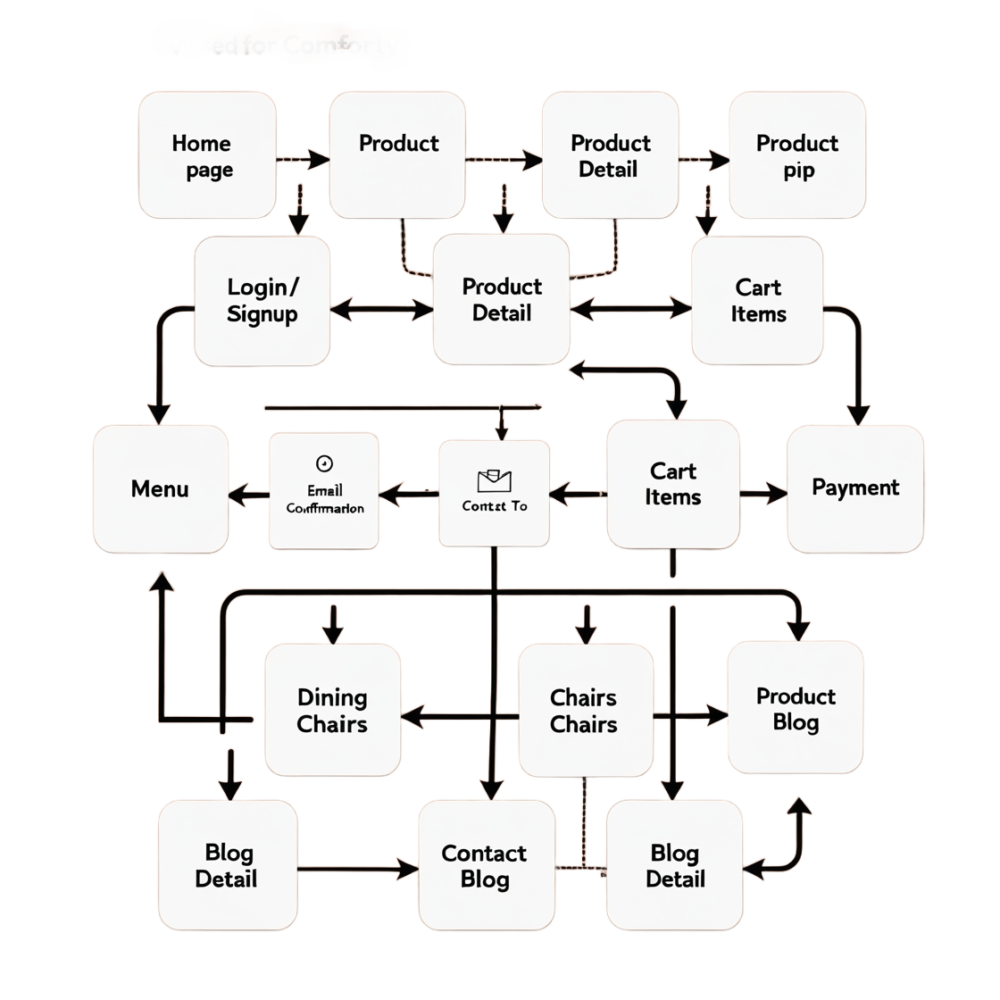

# Comforty Furniture Website System Architecture

## Overview
Comforty is an e-commerce platform specializing in stylish and comfortable chairs for various needs. The platform is built using Next.js 14 with TypeScript for optimal performance and Sanity CMS to manage content seamlessly. Below is the detailed system architecture designed to ensure scalability, maintainability, and a superior user experience.

## High-Level System Architecture

### Frontend Structure
**Framework**: Next.js 14 with TypeScript for fast server-side rendering (SSR) and dynamic routing.

#### Key Pages:
- **Home**: Showcases featured chair categories, trending products, and ongoing promotions.
- **Product Listing**: Displays all chair collections with filtering options (e.g., by type, material, price).
- **Product Details**: Dynamic page for individual chair details, including images, descriptions, and reviews.
- **Cart**: Shows selected products, allowing users to adjust quantities and view order summaries.
- **Checkout**: Securely handles payment and shipping information.
- **Order Confirmation**: Displays purchase confirmation and order details.
- **Admin Panel**: Reserved for admin tasks, including stock management, order tracking, and user analytics.

#### User-Specific Pages:
- **Login/Sign Up**: Facilitates secure user authentication.
- **User Dashboard**: Provides order history, shipment tracking, and saved preferences.

#### Admin-Specific Pages:
- **Analytics**: Visualizes sales trends, revenue, and product performance.
- **Stock Management**: Displays inventory data and low-stock alerts.
- **Order Management**: Tracks orders and shipping progress.

### Reusable Components:
- **ProductCard.tsx**: Renders chair details (image, name, price, label, etc.) across pages.
- **HeroSection.tsx**, **PopularProducts.tsx**: Key sections of the homepage to highlight Comforty’s unique offerings.
- **Filters.tsx**: Provides sorting options for the product listing page.

### CMS (Sanity)
Sanity Studio is utilized for backend management:
- **Products**: Schema includes product name, price, stock, materials, dimensions, and images.
- **Customers**: Stores login credentials, order history, and saved items.
- **Orders**: Tracks order details, including purchased products, payment status, and shipping information.
- **Inventory**: Manages product availability in real time.

### Data Management Features:
- **Custom Schemas**: Tailored to store and retrieve data for chairs, orders, and user accounts.
- **GROQ Queries**: Fetch real-time product and inventory data for seamless frontend updates.

## Third-Party API Integrations

1. **Payment Gateway (Stripe)**:
    - Handles secure payment transactions with support for credit/debit cards and digital wallets.
    - Utilizes Stripe Elements for collecting and validating payment details.

2. **Shipment Tracking (Shippo API)**:
    - Enables real-time shipment updates for customers.
    - **API Endpoints**:
        - `/api/products`: List available products.
        - `/api/shipment`: Create and manage shipments.
        - `/api/livetracking`: Real-time shipment tracking.

3. **Email Notifications**:
    - Integrates services like SendGrid to send order confirmation and shipping updates to customers.

## Workflow Overview

### User Workflow:
1. **Browse Products**:
    - Users view products fetched dynamically from Sanity via APIs.
    - Filters allow refined browsing by type, material, and price.
2. **Add to Cart**:
    - Users add chairs to their cart; the data is stored locally or synced to their profile after login.
3. **Checkout Process**:
    - CheckoutModal.tsx securely collects payment and shipping information.
4. **Order Confirmation and Tracking**:
    - Users receive an order summary and can track shipments through the user dashboard.

### Admin Workflow:
1. **Login**:
    - Admins log in securely to access the admin panel.
2. **Data Management**:
    - Manage inventory, monitor stock levels, and update product information via Sanity.
3. **Analytics and Trends**:
    - Analyze sales data and customer behavior to inform business decisions.

## Technologies and Tools
- **Frontend**: Next.js 14 with TypeScript
- **CMS**: Sanity
- **Payment Gateway**: Stripe
- **Shipment Tracking**: Shippo API
- **Hosting**: Vercel for fast and reliable deployment

## Data Flow
1. **Products**: Fetched from Sanity CMS and displayed dynamically.
2. **Cart**: Items stored in local storage or synced to the user profile after login.
3. **Orders**: Stored in Sanity CMS and accessible by both users and admins.
4. **Payments**: Processed through Stripe with webhook support for updates.
5. **Shipments**: Managed using Shippo API for real-time tracking.
